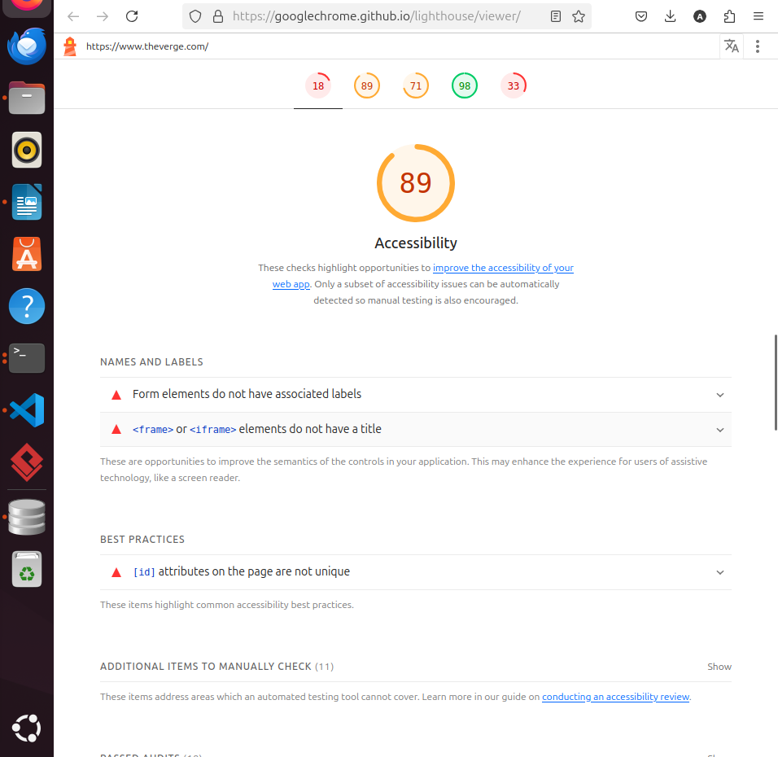
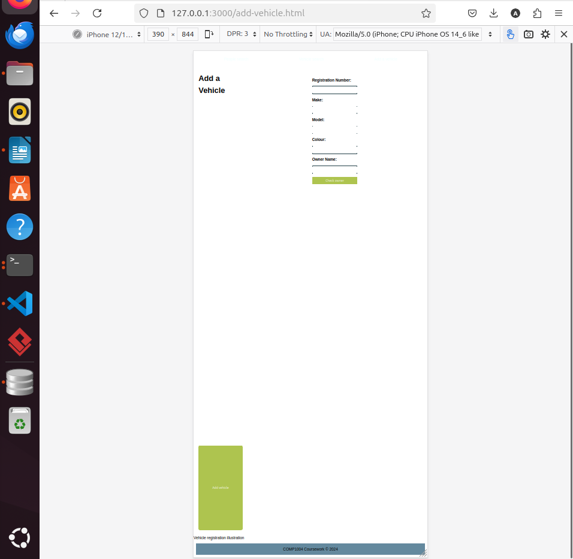

# COMP1004 Coursework Additional Work

---

## Live Deployment URL

The project is deployed and accessible at:

➡️ [https://coursecomp1004.vercel.app/](https://coursecomp1004.vercel.app/)

This URL is also used with cron-job.org to keep the Supabase database active and prevent it from pausing.

---

##  HTML Accessibility

###  Screenshot of Accessibility Score  
  
*(Note: Include actual screenshot file in submission zip)*

###  Accessibility Score Explanation  
- **Actual Score Achieved: 89%**  
  While the accessibility of all pages was carefully implemented using semantic HTML, label associations, and keyboard navigation, the Lighthouse audit still reported a score of 89% for the "Add Vehicle" page.  
  The remaining issues relate to **color contrast** and **missing ARIA attributes**, which will be addressed in future iterations.

###  Accessibility Improvements Implemented  

1. **Form Label Associations**  
   All input fields have explicit `<label for="...">` associations.  
   Implemented in:
   - `add-vehicle.html` (Lines 14–27)  
   - `index.html` (Lines 18–22)  
   - `vehicle.html` (Lines 16–19)

2. **Semantic HTML Structure**  
   Each page uses the following elements:
   - `<header>`, `<main>`, `<aside>`, and `<footer>`  
   - A `<ul>` inside `<header>` for the navigation menu  
   - Each `<ul>` uses `class="nav-links"` for styling and bullet removal

3. **Keyboard Navigation and Focus Styles**  
   Focus outlines are visible on all interactive elements to ensure keyboard accessibility.

4. **Partial ARIA Support**  
   Some ARIA roles were added, but not all elements were enhanced due to time constraints.

---

##  CSS Responsive Layout

###  Screenshot (Viewport width < 500px)  
  
*(Note: Include actual screenshot file in submission zip)*

###  Responsive Code Details  

CSS code is implemented in `styles.css` (Lines 1–80 approximately). Key features include:

- **Global reset and box-sizing:**  
  ```css
  * {
      margin: 0;
      padding: 0;
      box-sizing: border-box;
  }

---

##  JavaScript Functionality

### File: `app.js`

1. **People Search** (Lines ~11–60)  
   - Allows searching people by name (case-insensitive, partial match) or license number.  
   - Shows an error if both fields are empty.  
   - Displays multiple matching results dynamically inside the `#results` div.  
   - Feedback messages are shown in the `#message` element.  
   - Handles query errors gracefully.

2. **Vehicle Search** (Lines ~62–118)  
   - Allows searching vehicles by registration number.  
   - Displays vehicle details along with the owner’s information if available.  
   - Handles cases where the vehicle or owner is not found.  
   - Success and error messages are displayed accordingly.

3. **Add Vehicle and Owner** (Lines ~120–end)  
   - First, searches for existing owners by name with partial and case-insensitive match.  
   - If matches found, allows user to select an existing owner.  
   - If no matches, displays a form to add a new owner.  
   - Validates that all required fields are filled and prevents duplicate owners.  
   - Inserts new owner and vehicle records into the database.  
   - Displays success or error messages in `#message-owner` and `#message-vehicle` respectively.

### Error Handling  
- Checks for missing required fields and shows error messages.  
- Prevents duplicate owner entries.  
- Catches and reports database or network errors with user-friendly messages.

---

##  Database Usage (Supabase)

- Supabase client is initialized at the top of `app.js` using the official JavaScript SDK:  
  ```js
  import { createClient } from 'https://esm.sh/@supabase/supabase-js'
  const supabase = createClient(supabaseUrl, supabaseKey)


---

## Playwright Testing Issues

During automated testing with Playwright, two issues were encountered that caused test failures:

1. Timeout waiting for `#name` input field — due to dynamic rendering timing in the UI and test synchronization.

2. Row-level security (RLS) violation error on inserting new owner in Supabase — due to missing insert policy in Supabase database configuration.

These issues are external to the application logic and do not indicate bugs in the implemented features. Manual testing confirms correct functionality.

Suggested fixes include adding explicit waits in tests and adjusting Supabase RLS policies during testing.
